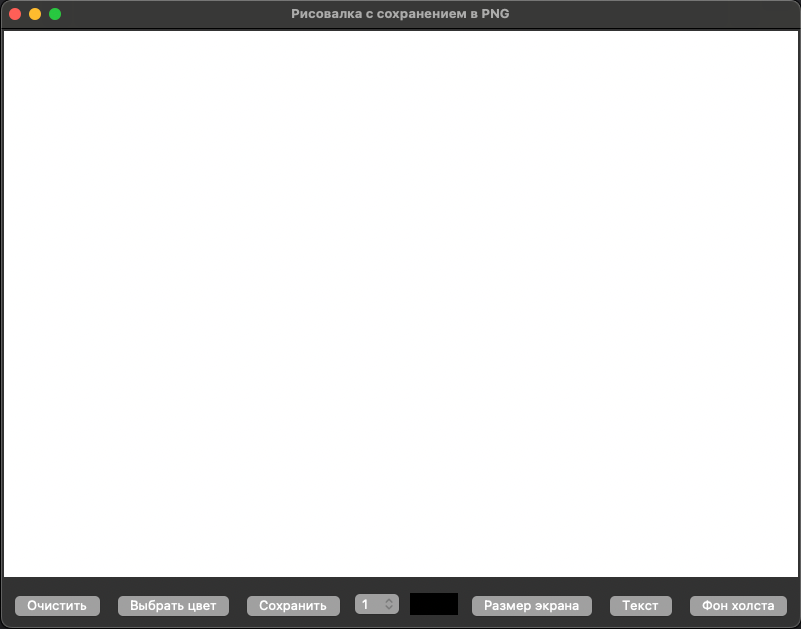

Конечно! Вот пример файла `README.md` для вашего проекта "Рисовалка с сохранением в PNG":

---

# Рисовалка с сохранением в PNG

Это простое приложение на Python с использованием библиотеки Tkinter, которое позволяет рисовать на холсте, выбирать цвет, размер кисти и сохранять результат в формате PNG.

## Основные функции

- **Рисование на холсте**: Используйте мышь для рисования на белом холсте.
- **Выбор цвета**: Нажмите кнопку "Выбрать цвет", чтобы изменить цвет кисти.
- **Выбор размера кисти**: Используйте выпадающее меню (OptionMenu) для выбора размера кисти.
- **Выбор цвета кисти**: Используйте правую кнопку мыши(на виндовс) и ctrl + левая кнопк(macOs) для выбора цвета кисти.
- **Клавиши быстрого действия**: Используйте  ctrl + "с" для выбора цвета кисти, и ctrl + "s" чтобы сохранить текущее изображение в формате PNG.
- **Очистка холста**: Нажмите кнопку "Очистить", чтобы стереть все нарисованное.
- **Изменение размера окна**: Нажмите на кнопку после откроется окно для ввода размеров
- **Сохранение изображения**: Нажмите кнопку "Сохранить", чтобы сохранить текущее изображение в формате PNG.

## Установка и запуск

1. Убедитесь, что у вас установлен Python 3.9 или выше.
2. Установите библиотеку Pillow, если она еще не установлена:

   ```bash
   pip install pillow
   ```

3. Скопируйте код приложения в файл `main.py`.
4. Запустите приложение:

   ```bash
   python main.py
   ```

## Как использовать

1. **Рисование**:
   - Перетащите мышь по холсту, чтобы рисовать.
   - Цвет и размер кисти можно изменить с помощью кнопок и выпадающего меню.

2. **Выбор цвета**:
   - Нажмите кнопку "Выбрать цвет", чтобы открыть палитру цветов.

3. **Выбор размера кисти**:
   - Выберите размер кисти из выпадающего меню.

4. **Выбор цвета кисти**: 
   - Используйте правую кнопку мыши(на виндовс) и ctrl + левая кнопка(macOs) для выбора цвета кисти.

5. **Клавиши быстрого действия**: 
   - Используйте  ctrl + "с" для выбора цвета кисти.
   - Используйте  ctrl + "s" чтобы сохранить текущее изображение в формате PNG.

6. **Очистка холста**:
   - Нажмите кнопку "Очистить", чтобы стереть все нарисованное.

7. **Изменение размера окна**:
   - Нажмите на кнопку после откроется окно для ввода размеров 

<br>
   
   - 

   <br>

8. **Сохранение изображения**:
   - Нажмите кнопку "Сохранить", чтобы сохранить текущее изображение в формате PNG.

## Структура проекта

- `main.py`: Основной файл с кодом приложения.
- `README.md`: Документация проекта.

## Зависимости

- Python 3.9 или выше.
- Библиотека Pillow (`pip install pillow`).

## Пример работы




